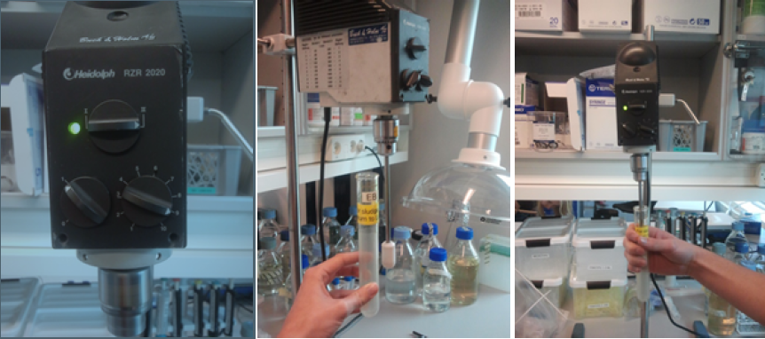

# DNA extraction from activated sludge
Version 6.0 - [download as pdf](link)

The protocol is a slightly modified version of the **FastDNA® Spin kit for soil**. It's important to standardise all steps in the protocol. Even small changes to the approach will result in measureable differences in the results!

## Sampling
* Activated sludge is collected from an active aeration tank, i.e. well mixed. Make sure that the aeration has been running for at least `5 min` and that the sampling device is lowered below the “water” surface. It is important that you do not get just a lot of foam into the device.
* Pour some of the content back into the aeration tank (so that it is possible to swirl/mix the remaining content).
* Mix the content by swirling before pouring the sample to a (plastic) sample bottle with a cap. Pour the remaining sludge back into the aeration tank.
* While keeping it on ice, bring the sample back to the lab and place it in the fridge (`4˚C`) until usage (maximum 24 hours, although that does change the community structure slightly!).
* For long time storage at `-80˚C` make 2 mL aliquots in CryoTubes. Remember to use a wide pipette tip and to mix the sample well.
* If you want to do community studies it is a good idea to fixate some sample for FISH.

>**Before usage or storage, the sample material must be homogenised.**

* Homogenisation can done using e.g. a Heidolph RZR 2020. Homogenise for `1 min` at the following settings:

## Sample input

* `0.5 mL` activated sludge with a `SS of ~5 mg/mL`.

## Preparation
* FastDNA® Spin kit for soil
* Three 2 mL tubes (DNAse free) per sample
* One 15 mL tube per sample
* Turn on the FastPrep machine
* Find ice

## Protocol - FastDNA® Spin kit for soil

### Sample frozen with liquid
* Defrost and vortex/homogenise the sample.
* Transfer `0.5 mL` to a 2 mL tube.
* Spin down at max speed for `5 min`.

### Sample on pellet form
* Re-dissolve in `980 µL Sodium Phosphate Buffer`, pH 8.
* Transfer all the liquid to a Lysing Matrix E tube using a `WIDE tip` (cut tips with a scissor). Work fast in the next steps to minimize DNA degradation.
* Add `120 μl MT Buffer`.

>**Homogenize in the FastPrep® Instrument for `4x40 seconds` at a `speed setting of 6.0`. Remember: between every bead beating cycle, the sample must be kept on ice for 2 min. Both the samples and the instrument have to cool down as they get quite hot.**

* Spin down at max rpm for `10 min` - If you haven't found or marked all tubes for the next steps do it now during this one so you can work faster and thereby minimize degradation. 
* Transfer supernatant to a clean `2.0 mL` microcentrifuge tube - keep the tubes on ice until all samples are processed. Add `250 µL PPS` (Protein Precipitation Solution) and mix by shaking the tube by hand `10 times`. The PPS can be added to the tube in advance.
* Centrifuge at `14,000 x g` for `5 min` to pellet precipitate. While the centrifuge is running, resuspend the `Binding Matrix` and add `1.0 mL` to a clean 15 mL tube.
* Transfer the supernatant to the 15 mL tube with Binding Matrix suspension.
* Invert by hand for `2 min` to allow binding of DNA.
* Place the tube in a rack for `3-5 min` (until the liquid appears clear) to allow settling of silica matrix.
* Remove and discard up to `2x750 µL` of supernatant being careful to avoid settled Binding Matrix. If there is no clear separation you can just apply the total volume to the filter and spin down twice, e.g. 2x750 µL.
* `Resuspend` Binding Matrix in the remaining amount of supernatant. 
* Transfer approximately `750 µL` of the mixture to a `SPIN™ Filter` and centrifuge at `14,000 x g` for `1 min`. If you have more sample than 750 µL you can repeat this step. 
* Empty the catch tube.
* Ensure that ethanol has been added to the Concentrated SEWS-M.
* Add `500 µL` prepared `SEWS-M` and gently resuspend the pellet using the force of the liquid from the pipet tip - or by stirring with a pipet tip.
* Centrifuge at `14,000 x g` for `1 min`. 
* Empty the catch tube and replace.
* Centrifuge at `14,000 x g` for `2 min` to “dry” the matrix of residual wash solution. 
* `Discard the catch tube` and replace with a new, clean tube. The new tube is the tube that the sample is to be stored in so be sure to label it properly.
* `Air dry` the SPIN™ Filter for `5 min` at room temperature with open lid.
* Gently resuspend Binding Matrix (above the SPIN filter) in `60 µL of DES`. Use a pipet tip to stir the matrix until it gets liquid. Make sure not to disrupt the filter.
* Centrifuge at `14,000 x g` for `1 min` to bring eluted DNA into the clean catch tube. Discard the SPIN filter. It can now be `stored at -20˚C or -80°C`.

## Sample DNA quality control and dilution

### Contamination and Concentration Check
* Measure using Nanodrop standard protocol (note down concentration, A260/280, A260/230 and compare the shape of absorbance curve to a reference).
* Based on the Nanodrop concentration measurements `dilute` all samples to `20 ng/ul` and in a volume of at least `20 ul`.
* Prepare a `1% agarose gel` prestained with gel red and run a total `50-80 ng` sample DNA for approximately 45 min at 120V together with 1kb ladder. Capture gel image on gel-doc and save. The majority of DNA should be high molecular >10 kb.
* Measure DNA concentration of diluted samples using `Qubit or TECAN`. Use this concentration as the final concentration (this is the one you should refer to when you start prepping samples for sequencing where the starting concentration is important).
* Quibit - dsDNA BR assay kit: Follow standard protocol. Measure in triplicate. Load at least 2 ul sample to avoid pipetting variance.
* TECAN - QUANT-iT  dsDNA BR assay kit: Follow standard protocol. Measure in triplicate. NB! Load 2 ul of the diluted sample (20 ng/uL) so the DNA concentration will be in range of the kit. Also load 8 ul buffer (total volume is then 10 ul) so that the volume in all wells are the same. - NB! This means that your sample is diluted 5 times.

